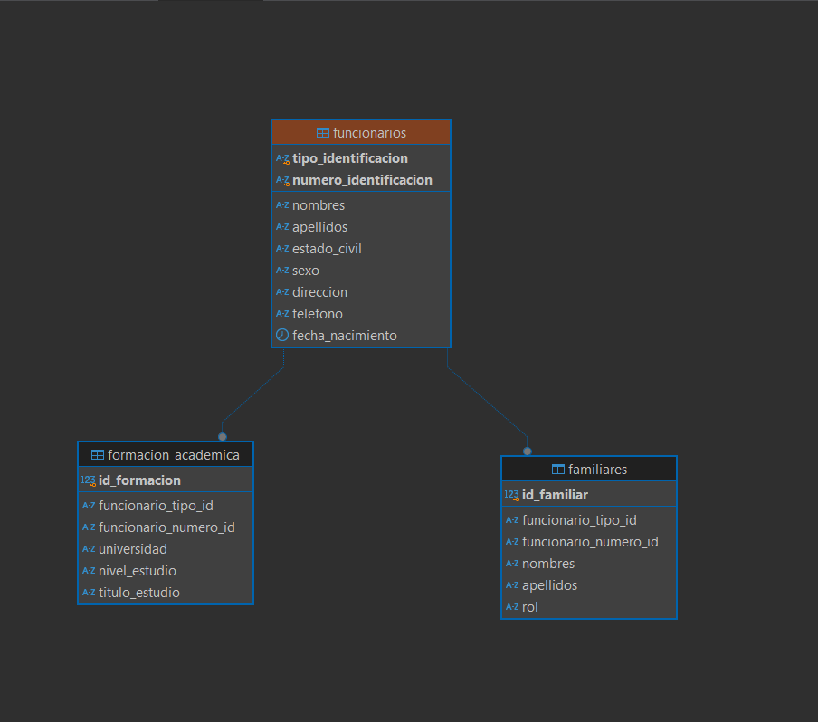

# 📦 Proyecto: Gestión de Funcionarios

Proyecto académico para la materia de Desarrollo de Software Seguro. Es una aplicación de escritorio (CRUD) desarrollada en **Java Swing** que gestiona los datos de los funcionarios de una institución, implementando el **Patrón DAO** y el **Manejo de Excepciones** en JDBC.

---

## 🛠️ Tecnologías Utilizadas

* **Lenguaje:** Java (JDK 24)
* **Interfaz Gráfica:** Java Swing
* **Gestión de Proyecto:** Apache Maven
* **Base de Datos:** PostgreSQL
* **Conexión:** JDBC (con `PreparedStatement`)
* **IDE:** Apache NetBeans 27

---

---

## 📊 Modelo Relacional (Diagrama ERD)

El diseño de la base de datos implementado en PostgreSQL sigue el siguiente modelo físico:



---

## 🚀 Guía de Instalación y Ejecución

Sigue estos pasos para configurar y ejecutar el proyecto localmente.

### 1. Prerrequisitos

* **Java JDK** (versión 17 o superior).
* Un servidor **PostgreSQL** instalado y en ejecución.
* Un IDE de Java como **Apache NetBeans** (recomendado).
* (Opcional) Un gestor de BD como **DBeaver** para ejecutar los scripts.

### 2. Configuración de la Base de Datos

Necesitarás ejecutar 3 scripts de SQL en orden.

#### Paso 2.1: Crear la Base de Datos

Conéctate a tu servidor PostgreSQL (con DBeaver, `psql`, etc.) y ejecuta esta sentencia:

```sql
CREATE DATABASE gestion_funcionarios;


-- 1. Tabla principal de Funcionarios
CREATE TABLE funcionarios (
    tipo_identificacion VARCHAR(10) NOT NULL,
    numero_identificacion VARCHAR(20) NOT NULL,
    nombres VARCHAR(100) NOT NULL,
    apellidos VARCHAR(100) NOT NULL,
    estado_civil VARCHAR(20),
    sexo CHAR(1),
    direccion VARCHAR(255),
    telefono VARCHAR(20),
    fecha_nacimiento DATE,
    PRIMARY KEY (tipo_identificacion, numero_identificacion)
);

-- 2. Tabla del Grupo Familiar
CREATE TABLE familiares (
    id_familiar SERIAL PRIMARY KEY,
    funcionario_tipo_id VARCHAR(10) NOT NULL,
    funcionario_numero_id VARCHAR(20) NOT NULL,
    nombres VARCHAR(100) NOT NULL,
    apellidos VARCHAR(100) NOT NULL,
    rol VARCHAR(50),
    FOREIGN KEY (funcionario_tipo_id, funcionario_numero_id) 
    REFERENCES funcionarios (tipo_identificacion, numero_identificacion)
    ON DELETE CASCADE
);

-- 3. Tabla de Formación Académica
CREATE TABLE formacion_academica (
    id_formacion SERIAL PRIMARY KEY,
    funcionario_tipo_id VARCHAR(10) NOT NULL,
    funcionario_numero_id VARCHAR(20) NOT NULL,
    universidad VARCHAR(150),
    nivel_estudio VARCHAR(50),
    titulo_estudio VARCHAR(150),
    FOREIGN KEY (funcionario_tipo_id, funcionario_numero_id) 
    REFERENCES funcionarios (tipo_identificacion, numero_identificacion)
    ON DELETE CASCADE
);

```

```sql
-- Insertamos 1er funcionario
INSERT INTO funcionarios (tipo_identificacion, numero_identificacion, nombres, apellidos, estado_civil, sexo, fecha_nacimiento)
VALUES ('CC', '123456', 'Ana', 'García', 'Soltera', 'F', '1990-05-15');

-- Insertamos familiares para Ana
INSERT INTO familiares (funcionario_tipo_id, funcionario_numero_id, nombres, apellidos, rol)
VALUES ('CC', '123456', 'María', 'Rojas', 'Madre');

-- Insertamos formación para Ana
INSERT INTO formacion_academica (funcionario_tipo_id, funcionario_numero_id, universidad, nivel_estudio, titulo_estudio)
VALUES ('CC', '123456', 'Universidad de Antioquia', 'Pregrado', 'Ingeniera de Sistemas');

-- Insertamos 2do funcionario
INSERT INTO funcionarios (tipo_identificacion, numero_identificacion, nombres, apellidos, estado_civil, sexo, fecha_nacimiento)
VALUES ('CE', '789012', 'Carlos', 'Pérez', 'Casado', 'M', '1985-11-30');

-- Insertamos familiares para Carlos
INSERT INTO familiares (funcionario_tipo_id, funcionario_numero_id, nombres, apellidos, rol)
VALUES ('CE', '789012', 'Laura', 'Gómez', 'Cónyuge');

```
---

### 3. Configuración del Código

El último paso es decirle al código Java cómo conectarse a tu base de datos.

1.  Abre el proyecto en NetBeans.
2.  Navega al archivo: `src/main/java/com/mycompany/gestionfuncionarios/dao/ConexionDB.java`.
3.  Modifica las siguientes constantes con tus credenciales personales de PostgreSQL:

```java
public class ConexionDB {

    // --- ¡¡IMPORTANTE!! ---
    // Reemplaza estos 3 valores con los de tu configuración local
    
    private static final String DB_NAME = "gestion_funcionarios"; 
    
    // El usuario de tu PostgreSQL
    private static final String USER = "tu_usuario_postgres"; // (Ej: "postgres")
    
    // La contraseña que definiste al instalar PostgreSQL
    private static final String PASSWORD = "tu_contraseña_secreta";
    
    // --- Fin de la configuración ---

    private static final String URL = "jdbc:postgresql://localhost:5432/" + DB_NAME;

    // ... (resto del código)
}
